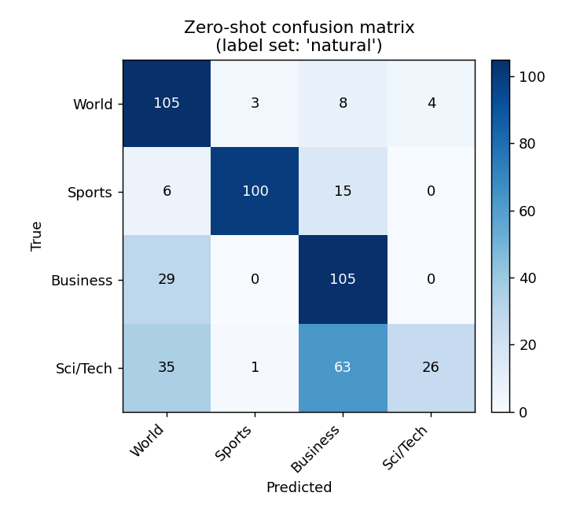
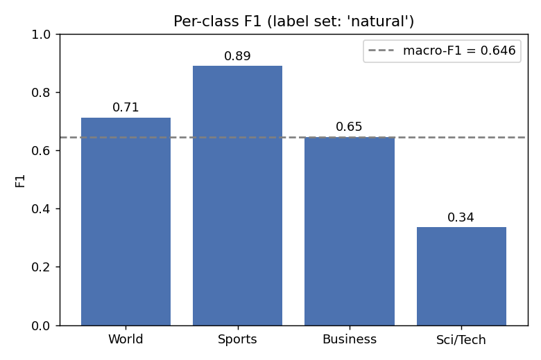
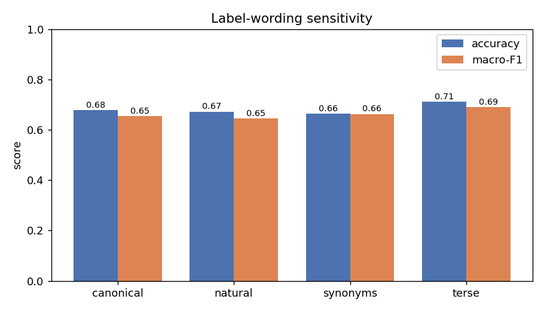
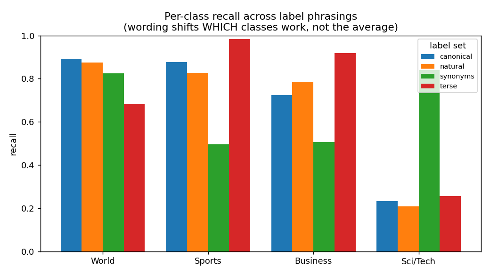

# Findings: Zero-Shot Text Classification with bart-large-mnli

Dataset: AG News (test split), 500 examples, 4 balanced classes.

## 1. Core performance (primary label set = `natural`)

- **Accuracy:** 0.672
- **Macro-F1:** 0.646

Per-class report:
```
              precision    recall  f1-score   support

       World      0.600     0.875     0.712       120
      Sports      0.962     0.826     0.889       121
    Business      0.550     0.784     0.646       134
    Sci/Tech      0.867     0.208     0.335       125

    accuracy                          0.672       500
   macro avg      0.744     0.673     0.646       500
weighted avg      0.741     0.672     0.643       500

```





## 2. Label-wording sensitivity

| label_set   | labels                                                               |   accuracy |   macro_f1 |
|:------------|:---------------------------------------------------------------------|-----------:|-----------:|
| canonical   | World | Sports | Business | Sci/Tech                                 |      0.678 |      0.654 |
| natural     | world news | sports | business | science and technology              |      0.672 |      0.646 |
| synonyms    | international affairs | athletics | finance and markets | technology |      0.664 |      0.663 |
| terse       | politics | sports | economy | science                                |      0.712 |      0.689 |


- Accuracy swing across phrasings: **4.8 points** (0.664 – 0.712)
- Macro-F1 swing: **4.3 points**
- Prediction flips vs `natural` (out of 500):
    - `canonical`: 73 flips (14.6%)
    - `synonyms`: 230 flips (46.0%)
    - `terse`: 116 flips (23.2%)



### 2a. Why the aggregate is stable but predictions churn

The aggregate accuracy barely moves, yet up to 46% of individual predictions flip. The reason: wording trades performance *between* classes rather than lifting all of them. Per-class **recall** by label set:

|           |   World |   Sports |   Business |   Sci/Tech |
|:----------|--------:|---------:|-----------:|-----------:|
| canonical |   0.892 |    0.876 |      0.724 |      0.232 |
| natural   |   0.875 |    0.826 |      0.784 |      0.208 |
| synonyms  |   0.825 |    0.496 |      0.507 |      0.840 |
| terse     |   0.683 |    0.983 |      0.918 |      0.256 |


Note the extremes: Sci/Tech recall is 0.208 with "science and technology" but 0.840 with the single word "technology" — while that same `synonyms` set craters Sports (0.826 -> 0.496, "athletics") and Business (0.784 -> 0.507, "finance and markets"). The gains and losses cancel in the average.




## 3. Per-class error analysis

Largest off-diagonal confusions (primary label set):

- **Sci/Tech → Business**: 63 examples
- **Sci/Tech → World**: 35 examples
- **Business → World**: 29 examples

**Plausible mechanism.** The dominant error is Sci/Tech absorbed into Business. AG News "Sci/Tech" stories are heavily about tech *companies*, products, IPOs and markets (Google, Microsoft, telecoms), so under an entailment model they genuinely entail "this text is about business" at least as strongly as "...about science and technology." The NLI model is not wrong about entailment — the label boundary AG News drew (science/tech vs business) is the artificial part. This is a topic-overlap failure, not a comprehension failure, which is exactly why a narrower cue word ("technology") recovers the class.

## 4. Supervised baseline (TF-IDF + logistic regression)

| model                             |   accuracy |   macro_f1 |   f1_World |   f1_Sports |   f1_Business |   f1_Sci/Tech |
|:----------------------------------|-----------:|-----------:|-----------:|------------:|--------------:|--------------:|
| TF-IDF + LogReg (trained on 8000) |      0.854 |      0.855 |      0.856 |       0.952 |         0.831 |         0.780 |
